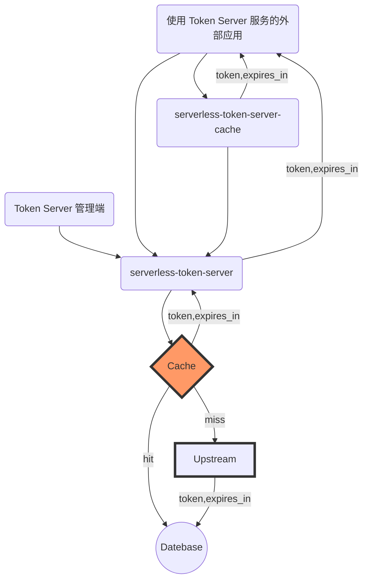

# 使用 Serverless 构建第三方 Token 缓存服务


## 服务拓扑



## 特性

- 缓存官方返回的数据，在有效时间内复用
- 防集中过期导致的爆发性请求

## 支持平台（已验证）

### 企业微信 API-企业内部开发

- 官方文档(https://developer.work.weixin.qq.com/document/path/91039)
- 创建平台信息

```sh
curl -H 'Content-Type: application/json' --data-binary '
{
  "id": "qywx_qynbkf",
   "config": {
           "url": "https://qyapi.weixin.qq.com/cgi-bin/gettoken",
           "method": "GET",
           "arguments": [
               {
                   "name": "corpid",
                   "place": "url",
                   "value": "$key_1"
               },
               {
                   "name": "corpsecret",
                   "place": "url",
                   "value": "$key_2"
               }
           ],
           "token_path": "access_token",
           "content_type": "json",
           "expires_in_path": "expires_in"
           }
}
' /api/realm
```

### 微信公众号 API-微信公众号开发

- 官方文档(https://developers.weixin.qq.com/doc/offiaccount/Basic_Information/Get_access_token.html)
- 创建平台信息

```sh
curl -H 'Content-Type: application/json' --data-binary '
{
  "id": "wxgzh",
   "config": {
           "url": "https://api.weixin.qq.com/cgi-bin/token",
           "method": "GET",
           "arguments": [
               {
                   "name": "appid",
                   "place": "url",
                   "value": "$key_1"
               },
               {
                   "name": "secret",
                   "place": "url",
                   "value": "$key_2"
               },
               {
                   "name": "grant_type",
                   "place": "url",
                   "value": "$key_3"
               }
           ],
           "token_path": "access_token",
           "content_type": "json",
           "expires_in_path": "expires_in"
           }
}
' /api/realm
```

## 使用方式（API 文档）

1.查看是否有对应的 Token 上游提供服务商信息

#### Request

- Method: **GET**
- URL: `/api/realm`

#### Response

- Body

```
{
  "data": {
      "list": object[]
      "total": number
  },
  "success": "ok"
}
```

2.新建 Secret

#### Request

- Method: **POST**
- URL: `/api/secret`
- Data:

```json
{
  "realm": "wxgzh", // Token 上游服务提供商 id
  "key": "wxgzh_secret", // 获取本 Token Server 的 Token 唯一标识
  "key_1": "******************",
  "key_2": "******************",
  "key_3": "client_credential"
}
```

#### Response

- Body

```json
{
  "realm": "wxgzh",
  "key": "wxgzh_secret",
  "key_1": "******************",
  "key_2": "******************",
  "key_3": "client_credential"
}
```

#### 示例（以微信公众号 API 为例）

```sh
curl -H 'Content-Type: application/json' --data-binary '
{
    "realm": "wxgzh",
    "key": "wxgzh_secret",
    "key_1": "******************",
    "key_2": "******************",
    "key_3": "client_credential"
}
' /api/secret
```

3.获取 Token

#### Request

- Method: **GET**
- URL: `/api/token`
- Data:

```json
{
  "realm": "wxgzh", // Token 上游服务提供商 id
  "key": "wxgzh_secret", // 获取本 Token Server 的 Token 标识
  "flush": false // 强制刷新 token，立即从上游服务商获取最新的 token
}
```

#### Response

- Body

```json
{
  "token": "***",
  "expires_in": 7200000, // 毫秒级单位
  "source": "database"
}
```
