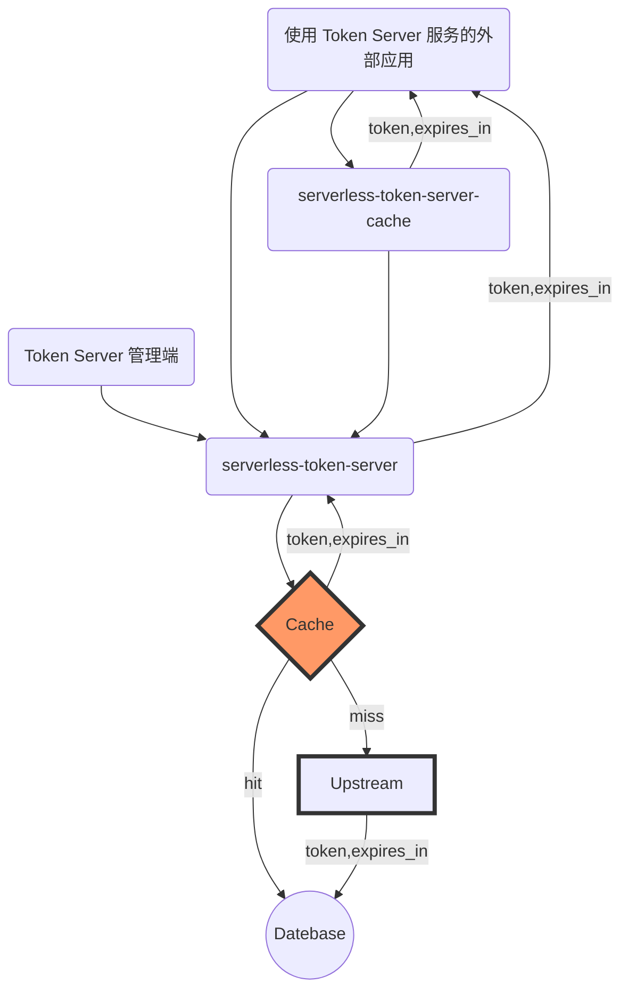

# 使用 Serverless 构建第三方 Token 缓存服务

> 通常地，第三方平台 API 认证采用 `OIDC` 协议，应用需要携带 Token 访问资源 API，资源服务 API 会通过拦截器查验 Token 中的 `scope` 字段是否包含特定的权限项目，从而决定是否返回资源。第三方平台通常会对 Token 的获取限制频率。

本服务作为获取其它服务商 Api Token 的桥梁，提供 Token 的获取和缓存等功能，并内嵌灵活的配置以覆盖大部分的从其他服务商获取 Token 的场景。

项目使用阿里巴巴出品的函数计算开发框架 [MidwayJs](https://github.com/midwayjs/midway) 进行函数开发、构建、发布，支持腾讯云、阿里云等多个云服务提供商部署，本服务的开源地址：[https://github.com/Geeeeeeeeeek/serverless-token-server](https://github.com/Geeeeeeeeeek/serverless-token-server)

## 特性

- Serverless 部署，零成本部署和运维
- 灵活的服务商配置、自定义密钥存储、Token 等信息通过 mysql 进行持久化
- 缓存官方返回的数据，在有效时间内复用
- 防集中过期导致的爆发性请求

## 服务拓扑



## 测试结果（ab 测试、监控指标、费用预估）

1.使用 ab 测试工具并发设置 300，连续请求 5s，粗略得到 QPS 为 1700：
- 为什么设置并发数为 300，因为阿里云函数计算默认最大并发为 300


2.阿里云函数计算监控指标：
- 请求次数约 1 万次
- 函数并发实例 250 个
- 函数错误次数 0 次

 

3.函数计算费用预估
- 1 万次函数调用费用预估约 0.00139 元

 

## 支持平台（已验证）

### 企业微信 API-企业内部开发

- 官方文档(https://developer.work.weixin.qq.com/document/path/91039)
- 创建平台信息

```sh
curl -H 'Content-Type: application/json' --data-binary '
{
  "id": "qywx_qynbkf",
   "config": {
           "url": "https://qyapi.weixin.qq.com/cgi-bin/gettoken",
           "method": "GET",
           "arguments": [
               {
                   "name": "corpid",
                   "place": "url",
                   "value": "$key_1"
               },
               {
                   "name": "corpsecret",
                   "place": "url",
                   "value": "$key_2"
               }
           ],
           "token_path": "access_token",
           "content_type": "json",
           "expires_in_path": "expires_in"
           }
}
' /api/realm
```

### 微信公众号 API-微信公众号开发

- 官方文档(https://developers.weixin.qq.com/doc/offiaccount/Basic_Information/Get_access_token.html)
- 创建平台信息

```sh
curl -H 'Content-Type: application/json' --data-binary '
{
  "id": "wxgzh",
   "config": {
           "url": "https://api.weixin.qq.com/cgi-bin/token",
           "method": "GET",
           "arguments": [
               {
                   "name": "appid",
                   "place": "url",
                   "value": "$key_1"
               },
               {
                   "name": "secret",
                   "place": "url",
                   "value": "$key_2"
               },
               {
                   "name": "grant_type",
                   "place": "url",
                   "value": "$key_3"
               }
           ],
           "token_path": "access_token",
           "content_type": "json",
           "expires_in_path": "expires_in"
           }
}
' /api/realm
```

## RoadMap

🚀 表示已经实现的功能，👷 表示进行中的功能，⏳ 表示规划中的功能，🏹 表示技术方案设计中的功能。

| 功能                                    | 状态      | 发布版本 |
| --------------------------------------- | --------- | -------- |
| 上游服务商并发限制，超时设计            | 👷 进行中 |          |
| token 控制台管理页面（react）           | 🏹 设计中 |          |
| 日志记录                                | 🏹 设计中 |          |
| 支持固定 token 模式                     | ⏳ 规划中 |          |
| serverless 函数计算部署                 | 🚀 已完成 | V1.0     |
| token 获取、缓存机制                    | 🚀 已完成 | V1.0     |
| realm 服务商、secret 应用密钥 crud 管理 | 🚀 已完成 | V1.0     |

## 使用方式（API 文档）

1.查看是否有对应的 Token 上游提供服务商信息

#### Request

- Method: **GET**
- URL: `/api/realm`

#### Response

- Body

```
{
  "data": {
      "list": object[]
      "total": number
  },
  "success": "ok"
}
```

2.新建 Secret

#### Request

- Method: **POST**
- URL: `/api/secret`
- Data:

```json
{
  "realm": "wxgzh", // Token 上游服务提供商 id
  "key": "wxgzh_secret", // 获取本 Token Server 的 Token 唯一标识
  "key_1": "******************",
  "key_2": "******************",
  "key_3": "client_credential"
}
```

#### Response

- Body

```json
{
  "realm": "wxgzh",
  "key": "wxgzh_secret",
  "key_1": "******************",
  "key_2": "******************",
  "key_3": "client_credential"
}
```

#### 示例（以微信公众号 API 为例）

```sh
curl -H 'Content-Type: application/json' --data-binary '
{
    "realm": "wxgzh",
    "key": "wxgzh_secret",
    "key_1": "******************",
    "key_2": "******************",
    "key_3": "client_credential"
}
' /api/secret
```

3.获取 Token

#### Request

- Method: **GET**
- URL: `/api/token`
- Data:

```json
{
  "realm": "wxgzh", // Token 上游服务提供商 id
  "key": "wxgzh_secret", // 获取本 Token Server 的 Token 标识
  "flush": false // 强制刷新 token，立即从上游服务商获取最新的 token
}
```

#### Response

- Body

```json
{
  "token": "***",
  "expires_in": 7200000, // 毫秒级单位
  "source": "database"
}
```

---

欢迎关注我的公众号“**Serverless Cloud**”，原创技术文章第一时间推送。

<center>
    
</center>
